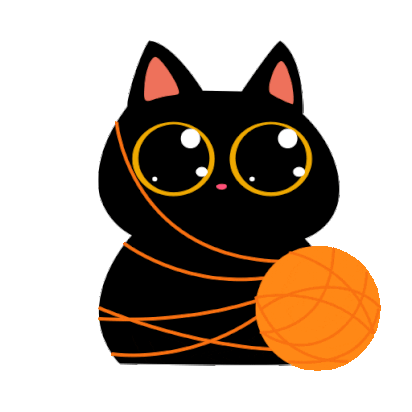

# MotivateBot

**MotivateBot** is a Telegram bot designed to send you motivational phrases accompanied by a little helper. Stay inspired every day with uplifting messages in three languages: **Ukrainian**, **English**, and **Spanish**. The bot aims to keep you motivated and positive.

---

## Features

- 🌍 **Multi-language Support**: Choose from **Ukrainian**, **English**, and **Spanish**.
- ✨ **Motivational Phrases**: Get a new motivational phrase to boost your day.
- 🤖 **Fun Helper**: Each message is accompanied by a fun sticker to brighten your mood.
- 📱 **Easy Access**: Interact with the bot using simple commands like `/start`.

## How It Works

1. **Start the Bot**: Type `/start` to begin your motivational journey.
2. **Choose Your Language**: Select your preferred language (Ukrainian, English, or Spanish).
3. **Get Motivated**: The bot sends you a random motivational phrase and a fun sticker to keep you going.
4. **Stay Inspired**: You can keep asking for more motivational messages with the "More Motivation" button!

---

## Installation

1. Click the link below to start using the bot:
   [MotivateBot](https://t.me/ZenMotivation_bot)

  

Stickers: https://t.me/addstickers/cat_Teftel_animated

